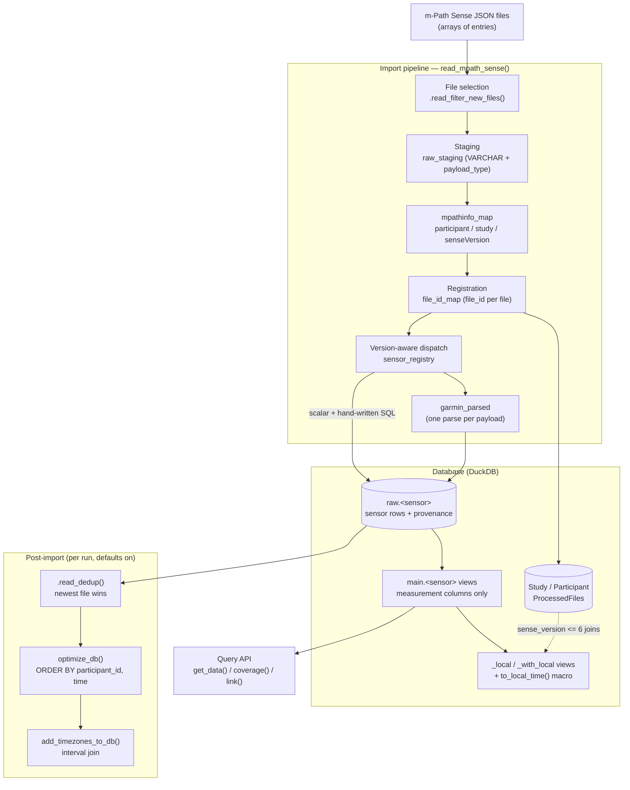

# mpathsenser architecture

*Package version 1.2.4.9000 · branch `move-to-duckdb` · source commit `4c8fc04` · 2026-09-21*

This document describes how `mpathsenser` is put together: the storage model, the import
pipeline, the correctness rules the pipeline guarantees, the timezone handling, and the
query/analysis layer. It is written for two readers at once — humans who need the *why*, and
agents who need stable symbol names and the rules that must not be broken.

It intentionally does **not** duplicate task-specific experiment history or detailed
benchmark results. Reproducible synthetic benchmarks live with their scripts in `data-raw/`;
host diagnostics and upstream reports live in `positron_diag/`. `AGENTS.md` contains working
instructions rather than a second architecture narrative.

Nothing here replaces the source. Where a behaviour matters, the file and symbol are named so
the reader can go look at the code, which is always current.

## Overview

`mpathsenser` reads the JSON files exported by the m-Path Sense mobile sensing app into a
[DuckDB](https://duckdb.org) database and provides convenience functions to inspect, process and
analyse the result. DuckDB is the only supported backend; SQLite support was removed in 1.2.4
and databases in the pre-1.3 layout (physical sensor tables in `main`) must be recreated.

Three layers, in the order data passes through them:

| Layer | Responsibility | Lives in |
|---|---|---|
| **Import pipeline** | Turn JSON files into sensor rows, at bounded memory, with provenance | `R/read_mpath_sense.R`, `R/read_helpers.R`, `R/ingest.R`, `R/sensor_registry.R` |
| **Database** | Store sensor rows plus metadata, and expose them read-only | `inst/extdata/dbdef.sql`, `inst/extdata/views.sql`, `R/database.R`, `R/add_timezones_to_db.R`, `R/timestamp_helpers.R` |
| **Query & analysis API** | Lazy extraction, coverage, linking, gaps, location, device info | `R/sensor_functions.R`, `R/coverage.R`, `R/linking.R`, `R/location_functions.R` |

Two design stances run through all of it:

* **Correctness and bounded memory before speed.** Sensor data arrives as deeply nested JSON
  with multi-hundred-kilobyte payloads; the pipeline is built so a batch cannot exhaust RAM and
  a bad file cannot corrupt a database. Optimizations are only kept when they preserve output
  byte-for-byte (`AGENTS.md`, "Performance principles").
* **Many readers, one writer.** All writes target the `raw` schema; all normal reads go through
  `main` views. Read-only connections are first-class (dashboards); concurrent writers are not
  supported.

## System diagram



## Storage model

### Physical schema

`inst/extdata/dbdef.sql` creates everything: the `raw` schema, the metadata tables, and 32
physical sensor tables. It is applied by `create_db()`, which prefers the repository copy over
the installed one so `pkgload::load_all()` never silently uses a stale schema.

| Object | Purpose |
|---|---|
| `raw` schema | Physical sensor tables. The only thing the importer and maintenance functions write to. |
| `Study(study_id, data_format)` | One row per study. |
| `Participant(participant_id, study_id)` | `participant_id` is `UINTEGER`, matching the m-Path Sense `connectionId` encoding. |
| `ProcessedFiles` | Import ledger: `file_id` (PK, default `nextval('processed_files_seq')`), `file_name`, `participant_id`, `sense_version`, `file_size_bytes`, `modified_at`, `processed_at`, plus `UNIQUE(file_name, participant_id, file_size_bytes, modified_at)`. |
| `processed_files_seq` | Sequence backing `file_id`. Never reset in normal operation — `file_id` ordering decides which file wins on deduplication. |
| `raw.<Sensor>` | One table per sensor (see `mpathsenser::sensors`). |

Every sensor row carries three internal provenance columns (all `NOT NULL UBIGINT`):

| Column | Meaning |
|---|---|
| `source_file_id` | The `ProcessedFiles.file_id` the row came from. |
| `source_row_id` | 1-based position of the JSON entry within its file, in the order m-Path Sense wrote it. |
| `source_measurement_id` | `1` for scalar entries; for unnested collections, the 1-based position within the collection (per-branch ordinals for `GarminActigraphy`). |

These three are the deduplication tie-break, and they are also a provenance pointer back into
the original file. Sensor tables deliberately have **no unique constraints**: duplicates are
possible (a renamed copy of a file) and are resolved by deduplication rather than prevented at
insert time. Plain appends therefore keep constant cost.

### Read layer: `main.<sensor>` views

`.create_sensor_views()` (`R/database.R`) introspects `information_schema`, drops the three
provenance columns, and creates one `CREATE OR REPLACE VIEW main.<sensor>` per raw table,
projecting measurement columns only (including `timezone` where present). Rows of the view are
identical to the raw table minus provenance.

* It runs on `create_db()` and on writable `open_db()`; read-only connections skip it (a
  read-only database must already contain the views).
* A fast path compares one aggregated column checksum of the `raw` layer against the `main`
  view columns and returns immediately when the database is complete (~10 ms instead of ~0.4 s
  of unconditional re-creation). Any drift falls back to a per-view comparison and only
  differing views are re-created.
* `<sensor>_optimize_tmp` tables left behind by an interrupted `optimize_db()` are excluded
  everywhere sensors are enumerated (`.create_sensor_views()`, `check_db()`).
* Views are resolved by name at query time, so `optimize_db()` can replace the underlying table
  without touching them.

### Local-time layer: `views.sql`

`inst/extdata/views.sql` is static SQL, applied by `.create_local_views()` (skipped when the
`to_local_time` macro already exists, so a read-only connection can be reopened). It defines:

* the DuckDB macro `to_local_time(ts, tz)`;
* `<sensor>_with_local` — all columns plus one localised column per timestamp (`time_local`, …);
* `<sensor>_local` — timestamp columns replaced by their local wall-clock values;

64 views in total (32 sensors × 2) plus the macro. Most read `main.<sensor>`; the four that
must honour the legacy `sense_version <= 6` behaviour (`AppUsage`, `Bluetooth`, `Location`,
`Weather`) read `raw.<sensor>` joined against `ProcessedFiles` instead, because they need the
version. The legacy columns are stored as UTC instants at import time and then rendered with
`AT TIME ZONE 'UTC'` so their historical wall-clock value is preserved without shifting it
twice — see `R/timestamp_helpers.R` and the header comment in `views.sql`.

Timestamps are always absolute `TIMESTAMPTZ` UTC instants. Local values are only ever
produced by the `_local`/`_with_local` views, `to_local_time()` or `collect_local()`.

## Import pipeline

Entry point: `read_mpath_sense(path, db, sensors, batch_size = 1000, recursive = TRUE,
deduplicate = TRUE, optimize = TRUE, .progress, .debug)`.

### 1. File selection

1. `list.files(pattern = "*.json$")`, then sorted **oldest to newest** by the timestamp embedded
   in the m-Path Sense file name (`m_Path_sense_YYYY-MM-DD_HH-MM-SS`); files without a parseable
   stamp sort last. Import order therefore is chronological, which makes the batch order
   deterministic and gives higher `file_id` values to newer files.
2. `file.info()` collects size and mtime. The mtime is **normalised to whole microseconds** with
   DuckDB's round-half-up cast before anything else, so the value inserted into
   `ProcessedFiles` is bit-identical to the one read back later. (A sub-microsecond mtime could
   otherwise round differently on the two sides, a formerly-imported file would look new, and
   its insert would collide with the `ProcessedFiles` UNIQUE constraint.)
3. **Empty (0-byte) files** cannot be staged and contain no mpathinfo or sensor observations.
   `.read_register_empty_files()` uses the permissive filename parser only for these files; an
   absent participant id or an id that cannot be stored as `UINTEGER` is reported and skipped.
   A missing study id falls back to `Unknown_Study`.
4. `.read_filter_new_files()` applies the early duplicate heuristic `(file_name, file_size_bytes,
   modified_at)` to all files before empty-file registration or JSON staging and keeps the first
   intra-run occurrence. It stages only the incoming keys and their input ordinals in a temporary
   DuckDB table, anti-joins against `ProcessedFiles`, and collects only surviving ordinals; the
   ledger is never materialized in R. It also reports whether the database was empty before the run
   (used for the deduplication choice below).
5. `sensors = NULL` resolves to the full registry through `.read_resolve_sensors()`.

`ProcessedFiles` enforces `(file_name, participant_id, file_size_bytes, modified_at)` and there is
deliberately **no content hash**. The early duplicate heuristic is cheaper and uses only the
basename, size, and mtime; normal exports encode participant id in the basename. A researcher
manually renaming different participants' files to the same basename while preserving size and
mtime could therefore skip one, an accepted edge case. For every non-empty file that passes the
heuristic, `mpathinfo` is authoritative for participant, study, and sense version: filename
metadata never validates or overrides it. Renamed copies are imported and sensor-level
deduplication resolves repeated measurements.

### 2. Batching and transactions

Files are split into batches of `batch_size`. `.read_mpath_sense_batch()` runs the whole batch
inside one transaction (`.read_db_transaction()` — rolls back on error *and* on user interrupt).
If the batch fails, every file of the batch is retried individually in its own transaction, so
only files that genuinely fail are reported; the rest of the batch is imported normally. A stale
transaction left behind by an interrupted session is rolled back at the start of the next run by
`.read_rollback_stale_transaction()`.

### 3. Staging (`raw_staging`)

`.read_mpath_sense_loop()` stages the entire batch with one `read_json()` call into a temp table,
which is what lets DuckDB parallelise file reading and ingest:

* `format = 'array'` is given explicitly (m-Path Sense writes JSON arrays); `auto` reads the file
  twice and roughly doubles staging memory. A non-array file falls back to `format = 'auto'`.
* Only `sensorStartTime`, `sensorEndTime` (`BIGINT`) and `data` are typed. `data` is kept as
  **`VARCHAR`**, not JSON: the document is parsed only by the sensor statements that need it, and
  `payload_type` is extracted with a regex on the serialised string instead of `data->>'__type'`.
  Both choices exist to keep staging memory bounded.
* `preserve_insertion_order = false` is set on every connection. The staged table's physical
  `rowid` still preserves *per-file* order (the single writer assigns rowids in emission order),
  and `source_row_id` is derived from it afterwards: add the column, then one
  `ROW_NUMBER() OVER (PARTITION BY source_file ORDER BY rowid)` pass joined back on `rowid`.
  A window over the *scan output* is not usable — parallel chunk order is scrambled.

`source_row_id` is deliberately **not** derived from `sensorStartTime`: start times are monotone
within a sensor but the file interleaves sensors, so time order would reorder entries and change
which row deduplication considers later.

### 4. Attribution (`mpathinfo_map`)

Every m-Path Sense file starts with an mpathinfo entry. `mpathinfo_map` holds one row per file,
taking the **first mpathinfo in file order** (`QUALIFY ROW_NUMBER() … ORDER BY source_row_id = 1`)
and extracting `connectionId → participant_id (UINTEGER)`, `studyName → study_id`
(fallback `Unknown_Study`) and `senseVersion → sense_version (INTEGER)`.

* Files without mpathinfo cannot be attributed → skipped and reported.
* Files whose `connectionId` is missing or non-numeric → skipped and reported.
* R-side file metadata is merged onto the SQL-side mpathinfo by `source_file`.

### 5. Registration and `file_id_map`

The batch registers metadata and builds the mapping every downstream statement joins against:

1. `Study` and `Participant` are inserted with `ON CONFLICT DO NOTHING` (tiny tables; the
   conflict scan is negligible).
2. `file_metadata_map` (temp) carries the R-side metadata plus `batch_order`.
3. `file_id_map` (temp) assigns `nextval('processed_files_seq')` in explicit `ORDER BY
   batch_order`. **Never assume an unordered `nextval()` follows input order** — a parallel scan
   interleaves sequence values, and `file_id` ordering decides deduplication winners.
4. `ProcessedFiles` is inserted with a **plain `INSERT`** of the explicit `file_id`. DuckDB
   implements `ON CONFLICT DO NOTHING` as a `MERGE_INTO` that joins the incoming batch against
   the *whole* `ProcessedFiles` table, so registration would grow linearly with database size; a
   plain append is constant cost. Safety comes from step 1 above: `.read_filter_new_files()`
   already removed previously processed files and intra-run duplicates, so every remaining row is
   new. The UNIQUE constraint stays as a consistency guarantee (it errors a batch if that
   invariant is ever violated), not as the duplicate guard.

### 6. Dispatch

Ingest is **version-aware**, and only for sensors that can actually produce rows:

* `sensor_registry` is keyed by `senseVersion` (`"5"`, `"6"`, `"default"` — all currently the same
  `new_sensor_registry()`). An unregistered version falls back to `"default"` and its number is
  collected for one aggregated warning at the end of the run.
* Sensors whose payload type does not occur in the batch are skipped (`active`).
* `staged_by_version` counts staged rows per `(payload_type, sense_version)`, so a sensor is only
  dispatched for a version whose files actually contain its payload type. Without this, a batch
  that mixes versions would run JSON-transforming statements that match nothing.
* All Garmin sensors share one payload type. When it is present, the batch builds
  `garmin_parsed` once per version (below) and the per-sensor statements read only that table.
* A Garmin sensor is additionally skipped when its array column holds no elements in any payload
  of the batch — one `SUM(LENGTH(col))` over the parsed payloads (a cheap scan of the
  list-offset vectors) decides that per array column.

After all batches: deduplicate (unless `deduplicate = FALSE`), optimise (unless
`optimize = FALSE`), then fill timezones when `Timezone` rows exist. Only the sensors that were
active in this run are passed to each of those steps. Unknown payload types and unknown versions
are reported once, aggregated, never per file.

## Sensor ingest

### Registry shape

`R/sensor_registry.R` holds, per sensor, its payload type and its spec. Most sensors fit one of
two statement shapes and are built by a shared helper from a spec written next to the payload
type:

| Helper | Shape | Built by |
|---|---|---|
| `scalar_sensor(sensor, type, columns)` | one row per staged entry; values read from the payload object | `ingest_scalar()` |
| `garmin_array_sensor(sensor, array, time, columns)` | one row per element of one `garmin_parsed` array column | `ingest_garmin_array()` |

Sensors that do not fit keep a hand-written function in `R/ingest.R`: `Accelerometer`, `AppUsage`,
`Bluetooth`, `BluetoothBeacon`, `Connectivity`, `Device`, `Location`, `Weather`, `GarminMeta`,
`GarminActigraphy`. Every registry entry's `fun` has the same signature — `function(sense_version)`
returning SQL — so dispatch is always `registry[[sensor]]$fun(v)`; the shared helpers return such a
closure rather than being a second kind of thing.

`array_schemas` holds the typed JSON schema per array sensor, `ignored_sensor_types` names payload
types that are known and deliberately not ingested (`dk.cachet.carp.triggeredtask`).

### Garmin single-parse model

A `garminalllogsdata` payload holds ~15 arrays. Parsing the full payload once per sensor would
parse every payload 14+ times — including for arrays that are absent. Instead the batch runs
`.read_garmin_parse_sql(v)` once: a CTAS over the staged payloads of that version that applies one
typed `json_transform` of the whole document into per-array list columns plus `fromTime`, `toTime`
and the `entryCounts` struct. Each Garmin ingest then expands exactly one column with
`CROSS JOIN LATERAL UNNEST(g.<array>) WITH ORDINALITY`, using the ordinality as
`source_measurement_id`. A missing array key yields `NULL` and therefore zero rows at no parse
cost.

`ingest_garmin_actigraphy()` is the exception: three `actigraphy1/2/3` arrays are combined with
`UNION ALL`, and offsets (`0`, `1e9`, `2e9`) are added to the ordinality so provenance triples stay
unique across branches.

### JSON and memory patterns

* **Typed lists, not JSON.** `.read_json_array_typed()` transforms an array (or a single value, or
  a missing key) directly into a list of typed `STRUCT`s. DuckDB's parsed-JSON representation costs
  ~1.5–2 KB per element, which is fatal for tens-of-thousands-element Garmin logs; typed elements
  cost tens of bytes.
* **Ordinals come from `WITH ORDINALITY`**, never from `UNNEST` emission order (scrambled under
  parallel scans) and never from `range()` + subscript (deterministic but ~2.5–4× slower).
* **Two deliberate exceptions.** `Bluetooth` / `BluetoothBeacon` enumerate with
  `range(1, GREATEST(COALESCE(len(l), 0), 1) + 1)` so that an empty `scanResult` still produces one
  row with NULL scan fields — the scan measurement itself is preserved. `AppUsage` expands its
  `usage` **object** with `json_each` and numbers elements by object key, since object members have
  no inherent position.
* **Pre-filter the staging read when a lateral parses `data`.** `.read_staging_payloads()`
  (Bluetooth, BluetoothBeacon, Connectivity) reads `raw_staging` through a derived table filtered
  by `payload_type`, because DuckDB evaluates a `CROSS JOIN LATERAL` expression for every staged
  row before the outer `WHERE` applies — including unrelated multi-hundred-KB Garmin payloads.
  Statements whose JSON work happens in the projection, in a `LEFT JOIN LATERAL`, or in a plain
  scalar lateral (the `garmin_parsed` CTAS) must **not** get this treatment; their plans already
  filter first.
* **One parse per row for many-field payloads.** The phone accelerometer payload has ~46 summary
  features; reading them with individual `data->>'…'` expressions parses the document once per
  expression. `ingest_accelerometer()` therefore reads them from a single typed
  `json_transform(s.data, schema)` and keeps the INSERT column list and the value expressions
  derived from one payload-key vector (`accel_col_map`, `accel_payload_order`), which must stay in
  sync with `dbdef.sql`.
* **Sentinel handling.** Garmin uses `-1` for missing values; `.read_null_neg()` turns those into
  `NULL`. `source_row_id` is taken from staging, `source_measurement_id` from the unnest ordinal.
* **Legacy timestamps.** `.source_timestamp_import_sql()` emits, for the columns listed in
  `.source_timestamp_fixes` and `sense_version <= 6`, a
  `CAST(CAST(value AS TIMESTAMP) AS TIMESTAMPTZ)` that keeps the historical wall-clock component
  (correct because the package forces the session timezone to UTC). Everything else is stored as a
  true UTC instant.

## Correctness semantics

### Deduplication

`.read_dedup()` in `R/read_helpers.R` keeps one row per **measurement key**:

| Key | Sensors |
|---|---|
| `(participant_id, time)` | the default — every other sensor |
| `+ package_name` | `AppUsage` |
| `+ bluetooth_device_id` | `Bluetooth` |
| `+ uuid, region` | `BluetoothBeacon` |
| `+ instance` | `GarminActigraphy` |
| `+ device_type` | `Heartbeat` |

Winner order, per key group:

```
source_file_id DESC, source_row_id DESC, source_measurement_id DESC, rowid DESC
```

i.e. **the newest file wins; within that file the row latest in source order wins**. The final
`rowid` is an inert tie-break for the (by construction impossible) case of two rows with an
identical provenance triple. Because this is the same last-wins rule for every sensor, the effect
is an upsert: a later measurement replaces an earlier one with the same key, whether the duplicate
came from the same file or another one. Consequences worth knowing:

* rows that were *removed* in a corrected re-upload survive — their key is no longer duplicated;
* interval sensors (`end_time` columns) keep the completed window when they repeat a start time;
* Garmin's recalculated point measurements (`GarminBBI`, `GarminEnhancedBBI`, `GarminHeartRate`,
  `GarminStress`) keep the recalculation, same file or not.

Two pass breadths, chosen once per run:

* **Scoped** (default after a non-empty database): the run's `file_id`s go into a small
  `dedup_files` temp table, and candidates are found with one grouped scan
  (`LEFT JOIN dedup_files … GROUP BY keys HAVING COUNT(*) > 1 AND COUNT_IF(f.file_id IS NOT NULL) > 0`).
  Candidate discovery therefore costs one pass regardless of how many rows were imported. The
  `file_ids` are never interpolated as an `IN (…)` literal — with tens of thousands of files that
  turned every membership test into an OR-chain.
* **Full-table** (`file_ids = NULL`): used when the database was empty before the run (every
  duplicate group necessarily involves a new row, and it also cleans rows left by interrupted
  runs) and by the exported `deduplicate_db()`.

Candidate joins hash on the NOT NULL base keys (`participant_id`, `time`) and apply the nullable
extras as residual `IS NOT DISTINCT FROM` filters, so DuckDB can hash-join instead of falling back
to a blockwise nested-loop join.

Each sensor is deduplicated in its own transaction, and only candidate key groups are ever touched
— rows outside them were deduplicated when they were imported. `read_mpath_sense()` reports nothing
about deduplication; `deduplicate_db()` returns a named count of removed rows per sensor.

### Skipped, empty and failed files

| Situation | Behaviour |
|---|---|
| Unchanged file already in `ProcessedFiles` | skipped silently (no-op re-run) |
| 0-byte file with a usable participant id | registered as processed; no sensor rows are staged |
| 0-byte file with no usable or storable participant id | warned about and returned as unprocessed |
| No mpathinfo entry | skipped, reported, warning "could not be attributed to a participant" |
| Non-numeric `connectionId` | skipped, reported (cannot be stored as `UINTEGER`) |
| Batch fails | batch rolled back; each file retried alone; only truly failing files reported |
| Unknown `senseVersion` | imported with the `default` parser + aggregated warning |
| Unknown payload type | not imported + aggregated warning listing types and counts |

`read_mpath_sense()` returns `""` invisibly on full success, otherwise the character vector of
problem files.

## Timezones and local time

Storage is `TIMESTAMPTZ` (absolute instant) plus an observation-level `timezone` column
(IANA name) on applicable sensor tables. Both facts are kept on purpose: the instant answers *when*
it happened, the timezone answers *how the participant's clock read then*, and DST transitions can
make two distinct instants share a local clock value.

`add_timezones_to_db()`:

1. Adds a `timezone TEXT` column to any requested raw table that lacks one.
2. Builds `temp_tz_intervals` **once** from `raw.Timezone` with a dplyr/dbplyr pipeline, then
   applies it to every sensor with a single equality join (`participant_id` match plus
   `time >= start_time AND (end_time IS NULL OR time < end_time)`).
   Consecutive events that share a timezone are collapsed into one run first — timezone sampling is
   far more frequent than timezone changes, and the old per-event join produced ~629 M
   intermediate rows on real data. The first interval per participant is opened at
   `TIMESTAMPTZ '-infinity'` so observations before the first event inherit the first known
   timezone; each interval ends at the participant's next interval start (`LEAD`).
   `IS NOT DISTINCT FROM` keeps runs of NULL timezone homogeneous.
3. `UPDATE … WHERE s.timezone IS NULL` — only NULL cells are filled. Rerunning is cheap and a
   timezone that was already set (or arrived natively from a newer m-Path Sense version) is never
   overwritten. Rows whose participant has no timezone events stay NULL and render as UTC.

`to_local_time(x, timezone)` is one interface with two backends:

* **Collected vectors** → `.to_local_time_r()` re-interprets each instant in its timezone and
  stores the result with technical tz `UTC` (R vectors carry only one timezone attribute).
* **Inside a lazy dbplyr query** → dbplyr calls the exported function while building the query and
  `.to_local_time_sql()` emits `dbplyr::sql_prefix("to_local_time", 2)`, so the DuckDB macro does
  the work in the database. Argument checks run in R on both paths, and a collected vector mixed
  into a lazy query is inlined as an epoch (`to_timestamp`) because a naive timestamp literal would
  be converted in the opposite direction by `AT TIME ZONE`.

The translation is registered in `.onLoad()` (`R/zzz.R`) via `registerS3method()` on
`sql_translation.duckdb_connection`, wrapping duckdb's own translation. Programmatic registration is
deliberate: a NAMESPACE directive produces a load-time "S3 method overwritten" message. Timezone
*names* are validated by whichever engine applies them (R/CCTZ and DuckDB/ICU ship different
databases, so validating in R could reject names DuckDB handles).

`collect_local()` collects a lazy table and converts every POSIXt column with `to_local_time()`,
unless the table is already a `_local`/`_with_local` view (checked through the `mpathsenser_sensor`
attribute that `get_data()` attaches).

## Maintenance operations

| Function | What it does | Notes |
|---|---|---|
| `optimize_db()` / `optimise_db()` | Rewrites selected `raw` tables as `ORDER BY participant_id, time` | Improves zonemap pruning and compression. Skips tables already physically sorted (a rowid inversion scan in SQL — physical order is only observable through `rowid`). Rewrites via `dplyr::compute(arrange(...))`, restores `NOT NULL` from `information_schema`, replaces the table with an unqualified `RENAME TO` inside a transaction. Excludes `Timezone`. |
| `deduplicate_db()` | Full-table dedup pass | Cleans duplicates that predate the current import (e.g. after an interrupt). |
| `add_timezones_to_db()` | See above | Reusable; only fills NULL cells. |
| `copy_db()` | Copies metadata + selected sensors into another database | Requires a file-backed target, quotes its path for `ATTACH`, uses `INSERT … SELECT` (metadata with `ON CONFLICT DO NOTHING`, raw tables without, since they have no unique constraints), then **re-syncs the target's sequence** (drop default, drop/recreate `processed_files_seq` at `MAX(file_id) + 1`, set default with an unqualified name). |
| `check_db()` | Validates a connection and the database layout | Rejects SQLite connections; verifies every sensor exists as a `raw` BASE TABLE *and* a `main` VIEW/BASE TABLE. Can be skipped per session with `options(mpathsenser.check_missing_sensors = FALSE)`. |
| `unzip_data()` | Extracts delivered `.zip` archives | `.zip` files are not read by the importer; unzip first. |

`check_arg()`, `check_db()`, `check_participants()`, `check_sensors()`, `check_dates()`,
`check_week_start()` and `check_offset()` in `R/input_checks.R` are the argument layer for every
exported function. `check_arg()` is deliberately used everywhere: R's lazy evaluation otherwise
surfaces a type error deep inside a query pipeline, and an explicit check names the offending
argument at the call site.

`.physical_sensor()` maps any user- or view-level sensor name back to the physical table name
(strips `_local` / `_with_local`, case-insensitively); all write paths (`deduplicate_db()`,
`optimize_db()`, `add_timezones_to_db()`, `copy_db()`) go through it, and `check_sensors()` accepts
view names as well as physical ones. `check_sensors(resolve = TRUE)` additionally returns the
canonical base sensor names, which the coverage code uses to normalise its `sensor` argument.

## Query and analysis layer

| Function | Contract |
|---|---|
| `get_data(db, sensor, participant_id, start_date, end_date)` | Returns a **lazy** dbplyr table over `main.<sensor>` (or a `_local`/`_with_local` view), with the sensor name attached as `mpathsenser_sensor`. Character/`Date` bounds select whole days: UTC for `time` (including `_with_local`) and local wall time for `_local`. `POSIXt` bounds are exact inclusive timestamps; `_local` uses the timestamp's displayed wall-clock fields. Day-end bounds exclude the following midnight. Filtering happens in DuckDB. |
| `get_nrows()`, `get_participants()`, `get_studies()`, `get_processed_files()` | Database introspection; `get_nrows()` counts per sensor and is the slow one on large databases. |
| `coverage()` / `collect.coverage()` / `plot.coverage()` / `coverage_frequency()` | Coverage per bin (`by = minute/hour/day/week/month`), optionally averaged within a recurring `cycle`, using `metric = "count"` for distinct samples or `metric = "time"` for the union of expected-length observation intervals. All aggregation is built by the `.coverage_sql*()` helpers and executed inside DuckDB; missing bins are zero-filled within each participant's observation span, and only the first/last partial bins are prorated. |
| `identify_gaps()` / `add_gaps()` | Finds gaps in a sensor stream and annotates data with them. |
| `link()` / `link_gaps()` / `bin_data()` | Links measurements to a time scale (e.g. ESM questionnaires), links gaps to data, and bins time series. |
| `moving_average()` | Lazy, participant-partitioned sample averages over closed centered elapsed-time windows; applies `get_data()` filters first and calculates membership with a DuckDB `RANGE` window. |
| `device_info()` / `installed_apps()` / `app_category()` | Device metadata, installed apps, and Google Play category lookup (network, rate-limited). |
| `haversine()`, `location_variance()`, `geocode_rev()` | Distance, location variance, reverse geocoding (network: Nominatim). |
| `sensors` | Character vector of the 32 physical sensor names. |

`ensure_suggested_package()` gates optional dependencies (`ggplot2` for plotting, `curl` / `httr` /
`rvest` for the network-facing helpers). `app_category()` and `geocode_rev()` are the two
functions that make external HTTP requests and both rate-limit themselves.

## Development and extension

### Adding a sensor

1. `inst/extdata/dbdef.sql`: add `raw.<Sensor>` (with `participant_id`, `time`, the measurement
   columns, and the provenance columns; `NOT NULL` on the base keys).
2. Add the name to the `sensors` vector in `R/database.R`.
3. `R/sensor_registry.R`: add the entry — `scalar_sensor()` / `garmin_array_sensor()` if it fits a
   shared shape (and the array schema in `array_schemas` if it is a Garmin array), otherwise a
   hand-written `ingest_<sensor>()` in `R/ingest.R`.
4. `read_dedup_keys` in `R/read_helpers.R` if the measurement key needs extras.
5. `views.sql`: the `main.<sensor>` view is created automatically (`.create_sensor_views()`
   introspects `information_schema`), but the local views are static SQL — add
   `<Sensor>_with_local` and `<Sensor>_local` by hand, and add the sensor to the legacy join
   list only if its timestamps need the `sense_version <= 6` treatment.
6. Tests: `tests/testthat/test-ingest.R` (statement template), `test-end-to-end-sensors.R`
   (fixture → rows), plus `vignettes/articles/data-overview.Rmd` (generated from `dbdef.sql`) and
   `_pkgdown.yml` if the sensor adds public API.

### Invariants

* `file_id` order = chronological batch order; dedup depends on it.
* `source_row_id` comes from the staged rowid window, `source_measurement_id` from `WITH
  ORDINALITY`; never from scan emission order.
* Writes target `raw.*`; reads go through `main.*`. Never resolve a bare sensor name inside
  `.read_dedup()`.
* Every batch registers metadata and sensor rows from the same `file_id_map`.
* The `ProcessedFiles` UNIQUE constraint, the microsecond mtime normalisation and the plain
  `INSERT` are one mechanism — changing one of them requires revisiting the others.
* Timezone filling only ever writes NULL cells.
* Timestamps stay `TIMESTAMPTZ`; local values are explicit (`_local` views,
  `to_local_time()`, `collect_local()`).
* `create_db()` and `open_db()` install and load the `icu` and `json` extensions explicitly
  (`.ensure_duckdb_extensions()`); never rely on DuckDB autoloading.
* Keep the `[Xms]` debug timing format (`R/read_helpers.R`, `.read_debug_time()`): downstream log
  parsing depends on it.

### Tests, CI, tooling

* `testthat` (edition 3) under `tests/testthat/`; fixtures in `inst/testdata/` (including the
  `broken/` corpus of truncated, empty and illegal-ASCII files) and the shipped example capture
  in `inst/extdata/example/` (27 m-Path zips from one Android participant) with its derived
  parquet snapshot in `inst/extdata/example-db/`, rebuilt by `data-raw/build_example_db.R`.
  `helper-setup.R` builds throwaway databases; run test files individually — many DuckDB
  connections in one long session can flake.
* GitHub Actions: `R-CMD-check.yaml` (5 OS/R combinations), `test-coverage.yaml` (covr → Codecov),
  `pkgdown.yaml` (site deploy), `document.yaml` (roxygenize and commit `man/`, `NAMESPACE`),
  `format-suggest.yaml` (Air formatting suggestions on PRs).
* Documentation is roxygen2 in `R/`, never edited in `man/`. Authoritative narrative docs are
  `vignettes/mpathsenser.Rmd` (workflow), `vignettes/articles/data-overview.Rmd` (schema, generated
  from `dbdef.sql`) and `_pkgdown.yml` (reference index — every exported topic must appear there or
  be `@keywords internal`, or CI fails).
* Reproducible synthetic benchmarks live in `data-raw/`; host diagnostics and upstream reports
  live in `positron_diag/`. `AGENTS.md` contains the agent workflow and data-safety rules.

### Known costs and open questions

These are measured behaviours; supporting reproductions and investigation history live in
`positron_diag/`:

* Staging dominates on very large corpora and scales with file count; Garmin array ingests dominate
  ingest time.
* The `_optimize_tmp` + `RENAME` rewrite in `optimize_db()` costs seconds per large table, which is
  why the importer optimises only the sensors it touched.
* On some hosts (IDE-hosted R sessions on Windows), DuckDB's parallel queries lose effective
  parallelism and the same import takes ~2.5× longer than under `Rscript`, with identical output
  (same rows, same dedup counts). This is a host/launcher effect, not an importer effect; the
  investigation and reproductions are in `positron_diag/`.

## Code reference index

| Area | File | Key symbols |
|---|---|---|
| Import entry point | `R/read_mpath_sense.R` | `read_mpath_sense()`, `.read_mpath_sense_batch()`, `.read_mpath_sense_loop()`, `.read_rollback_stale_transaction()` |
| Staging, dedup, file filtering | `R/read_helpers.R` | `.read_filter_new_files()`, `.read_register_empty_files()`, `.read_dedup()`, `read_dedup_keys`, `.read_db_transaction()`, `.read_sql_array()`, `.read_json_array_typed()`, `.read_version_filter()`, `.read_debug_time()` |
| Sensor statements | `R/ingest.R` | `ingest_scalar()`, `ingest_garmin_array()`, `ingest_accelerometer()`, `ingest_appusage()`, `ingest_bluetooth()`, `ingest_bluetooth_beacon()`, `ingest_connectivity()`, `ingest_device()`, `ingest_garmin_meta()`, `ingest_garmin_actigraphy()`, `ingest_location()`, `ingest_weather()`, `.read_garmin_parse_sql()`, `.read_staging_payloads()`, `.accel_feature_exprs()` |
| Registry | `R/sensor_registry.R` | `scalar_sensor()`, `garmin_array_sensor()`, `new_sensor_registry()`, `sensor_registry`, `array_schemas`, `ignored_sensor_types` |
| Database lifecycle | `R/database.R` | `create_db()`, `open_db()`, `close_db()`, `copy_db()`, `optimize_db()`, `deduplicate_db()`, `.create_sensor_views()`, `.create_local_views()`, `.has_mpathsenser_schema()`, `.ensure_duckdb_extensions()`, `.configure_duckdb()`, `sensors` |
| Schema | `inst/extdata/dbdef.sql` | `raw.*` tables, `Study`, `Participant`, `ProcessedFiles`, `processed_files_seq` |
| Local views & macro | `inst/extdata/views.sql` | `to_local_time` macro, `<sensor>_local`, `<sensor>_with_local` |
| Timezones | `R/add_timezones_to_db.R` | `add_timezones_to_db()`, `temp_tz_intervals` |
| Timestamps | `R/timestamp_helpers.R` | `to_local_time()`, `collect_local()`, `.to_local_time_r()`, `.to_local_time_sql()`, `.source_timestamp_import_sql()`, `.source_timestamp_fixes`, `sql_translation.duckdb_connection` |
| Argument checks | `R/input_checks.R` | `check_arg()`, `check_db()`, `check_participants()`, `check_sensors()`, `.physical_sensor()`, `.standard_sensor_names()`, `check_dates()`, `.is_date()`, `check_week_start()`, `check_offset()`, `ensure_suggested_package()` |
| Query API | `R/sensor_functions.R` | `get_data()`, `identify_gaps()`, `add_gaps()`, `moving_average()`, `device_info()`, `installed_apps()`, `app_category()` |
| Coverage | `R/coverage.R` | `coverage()`, `collect.coverage()`, `plot.coverage()`, `coverage_frequency()`, `.coverage_sql()` |
| Linking/ESM | `R/linking.R` | `link()`, `link_gaps()`, `bin_data()`, `link_intervals()` |
| Location | `R/location_functions.R` | `haversine()`, `location_variance()`, `geocode_rev()` |
| Utilities | `R/utils.R` | `unzip_data()` |
| Package hooks | `R/zzz.R` | `.onLoad()` (dbplyr translation registration, options) |

## Glossary

| Term | Meaning |
|---|---|
| **Batch** | A group of files staged and ingested in one transaction (`batch_size`, default 1000). |
| **Measurement key** | The tuple that defines "the same measurement" for deduplication: `participant_id` + `time` + sensor extras. |
| **Provenance triple** | `source_file_id`, `source_row_id`, `source_measurement_id` — where a row came from and how late it was written. |
| **Scoped dedup** | Dedup restricted to key groups involving rows imported by the current run. |
| **`file_id`** | `ProcessedFiles` identity, assigned in chronological batch order; higher = newer, which decides dedup winners. |
| **UTC timestamp** | Absolute `TIMESTAMPTZ` instant, as stored in `raw.*` and exposed by `main.*`. |
| **Local view** | `_local` / `_with_local` view exposing participant-local wall-clock values. |
| **Legacy columns** | The few timestamps that m-Path Sense ≤ 6 wrote as local wall-clock values (`AppUsage`, `Bluetooth`, `Location`, `Weather`). |
| **senseVersion** | Version reported by the m-Path Sense export; selects the parser set in `sensor_registry`. |
| **Payload type** | The `__type` field of a JSON entry (e.g. `dk.cachet.carp.stepcount`), mapped to a sensor by the registry. |
